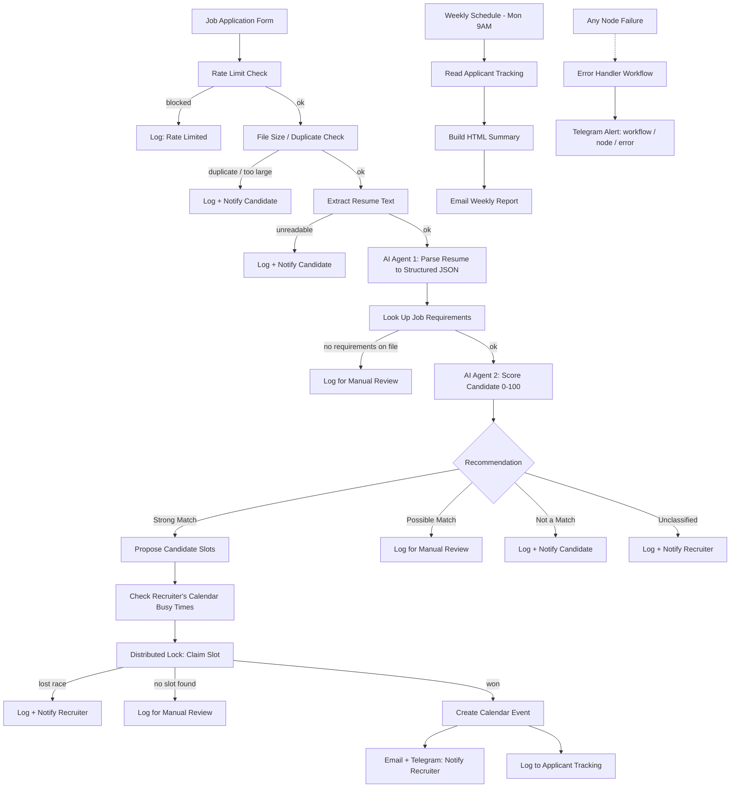

# AI Recruiter Assistant

An end-to-end AI recruiting automation pipeline built in [n8n](https://n8n.io) — resume parsing, LLM-based candidate scoring against job requirements, and automated interview scheduling with live Google Calendar integration, race-condition-safe double-booking prevention, and centralized error handling.

Personal project. Not affiliated with any employer or client.

---

## What it does

A candidate submits a resume through a public form. The pipeline reads the resume, scores it against the job's requirements using an LLM agent, and — for strong matches — finds a free slot on the recruiter's calendar and books the interview automatically. Every outcome (match, no match, unreadable file, duplicate application, scheduling conflict, rate-limited spam) is logged to a tracking sheet and, where relevant, the candidate and recruiter are notified.

Three workflows make up the system:

| Workflow | Trigger | Purpose |
|---|---|---|
| **AI Recruiter Assistant** | Public form submission | Core pipeline: parsing, scoring, scheduling |
| **AI Recruiter Assistant – Weekly Report** | Scheduled, Monday 9 AM | Digest email: volume, match breakdown, review backlog |
| **AI Recruiter Assistant – Error Handler** | Any node failure in the above | Telegram alert with workflow/node/error detail |

## Architecture

## Key engineering pieces

**Distributed concurrency lock.** When multiple candidates qualify for the same interview slot, a naive check-then-book has a race window. This pipeline uses an n8n Data Table as a lightweight distributed lock: each execution inserts a claim row, re-queries all claims for that slot, and the execution holding the lowest database-assigned row `id` wins. Losers clean up their own row and fall back to manual review. A TTL prevents a crashed execution from permanently blocking a slot.

**Prompt-injection-aware agents.** Both LLM agents (resume parser, candidate scorer) are instructed to treat resume and job-requirement content strictly as data, never as instructions, and are constrained to structured JSON output via schema-enforced parsers — so a malicious resume can't redirect the agent's behavior or produce an unparseable response.

**Rate limiting.** Every form submission is logged to a Data Table before any processing starts. If the same email submits more than 3 times in a rolling 10-minute window, the submission is logged and dropped — no file parsing, no LLM calls, no confirmation email (so an automated abuser gets no signal that they've been blocked).

**Centralized error handling + audit logging.** Every branch of the pipeline — success or failure — writes a row to the Applicant Tracking sheet with status and notes. Any unhandled node failure anywhere in the main workflow triggers the Error Handler workflow, which posts a Telegram alert naming the workflow, node, and error message.

**Configurable, not hardcoded.** Recruiter email and Telegram chat ID live in a single `Config` node at the top of each workflow rather than being scattered inline across nodes — one place to change per environment.

## Tech stack

- **Orchestration:** n8n
- **LLM:** [your OpenRouter model/provider here]
- **Calendar / notifications:** Google Calendar, Gmail, Telegram
- **Data:** Google Sheets (Applicant Tracking), n8n Data Tables (scheduling locks, rate limiting)

## Setup

1. Import the three workflow JSON files into n8n.
2. Create two Data Tables: one for scheduling locks, one for rate limiting (see `Config` and Data Table nodes in the main workflow for the expected schema).
3. Connect credentials: Google Sheets, Google Calendar, Gmail, Telegram, and your LLM provider.
4. Set your own values in each workflow's `Config` node (recruiter email, Telegram chat ID).
5. In the main workflow's Settings, set **Error Workflow** to "AI Recruiter Assistant – Error Handler".
6. Point the Applicant Tracking and Job Requirements Google Sheets at your own spreadsheets.
7. Activate all three workflows.

## Known limitations

- Resume intake accepts PDF only.
- Scheduling assumes a single recruiter calendar; no multi-interviewer support.
- Rate-limit and lock Data Tables grow unbounded — fine at portfolio scale, would need a cleanup job in production.
- No automated test suite; prompt-injection resistance was checked with manual adversarial inputs rather than a repeatable test harness.

## License

MIT — feel free to reference the architecture, not intended for production use as-is.
